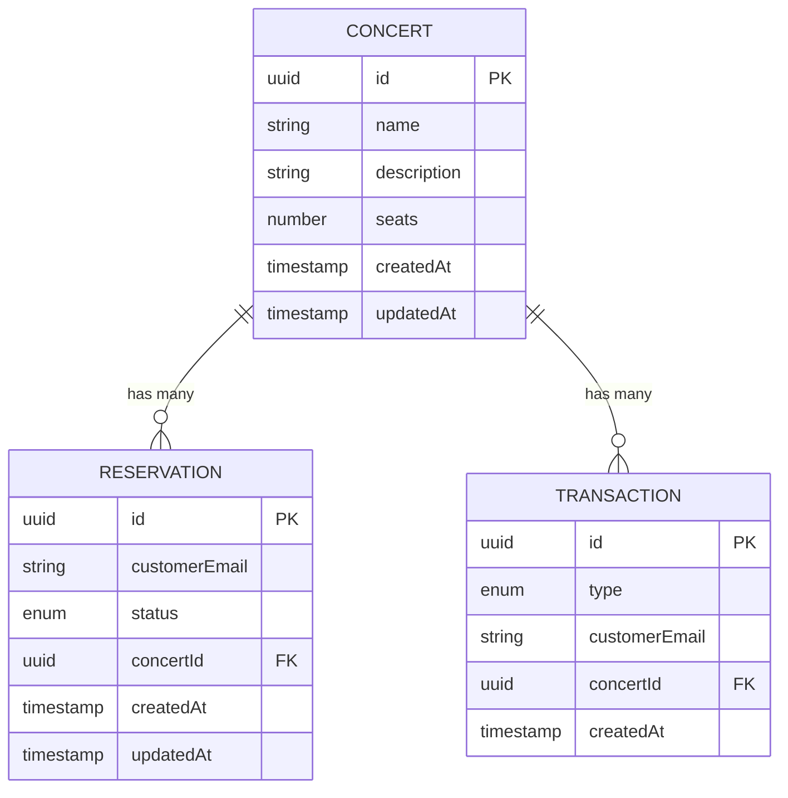

# Concert Booking System - Backend

This is a concert booking system backend built with NestJS. It provides APIs for managing concerts, reservations, and transactions. The system allows users to browse available concerts, make reservations, and complete transactions for concert tickets.

## Tech Stack

- **Framework**: [NestJS](https://nestjs.com/) v11 - A progressive Node.js framework
- **Database**: PostgreSQL with TypeORM for database management
- **API Documentation**: Swagger/OpenAPI
- **Language**: TypeScript
- **Key Dependencies**:
  - `@nestjs/common`, `@nestjs/core`, `@nestjs/platform-express` - Core NestJS packages
  - `@nestjs/typeorm` - TypeORM integration for database management
  - `@nestjs/swagger` - API documentation
  - `@nestjs/config` - Configuration management
  - `class-validator`, `class-transformer` - Data validation and transformation
  - `pg` - PostgreSQL client

## Project Structure

```
src/
├── config/          # Configuration files
├── modules/         # Feature modules
│   ├── concerts/    # Concert management
│   ├── reservations/# Reservation system
│   └── transactions/# Transaction processing
└── migrations/      # Database migrations
```

## Database Schema

The application uses PostgreSQL with TypeORM and consists of three main entities with the following relationships:



### Entities

1. **Concert**

   - `id` (UUID, Primary Key)
   - `name` (String)
   - `description` (String)
   - `seats` (Number)
   - `createdAt` (Timestamp)
   - `updatedAt` (Timestamp)
   - Has many Reservations
   - Has many Transactions

2. **Reservation**

   - `id` (UUID, Primary Key)
   - `customerEmail` (String)
   - `status` (Enum: 'confirmed' | 'cancelled')
   - `createdAt` (Timestamp)
   - `updatedAt` (Timestamp)
   - Belongs to one Concert

3. **Transaction**
   - `id` (UUID, Primary Key)
   - `type` (Enum: 'reservation_created' | 'reservation_cancelled')
   - `customerEmail` (String)
   - `createdAt` (Timestamp)
   - Belongs to one Concert

## Prerequisites

- [nvm (Node Version Manager)](https://github.com/nvm-sh/nvm#installing-and-updating)
- [Docker](https://www.docker.com/get-started/)
- corepack (will be installed automatically if missing)

## Getting Started

The easiest way to set up the development environment is using the provided Makefile:

```bash
make setup
```

This single command will:

1. Install and configure the correct Node.js version (22.x)
2. Install and configure pnpm (10.9.0)
3. Create a .env file with default configuration
4. Install project dependencies
5. Start the PostgreSQL database container
6. Run database migrations

After setup is complete, start the application:

```bash
pnpm start
```

### Manual Setup

If you prefer to set up manually, follow these steps:

1. Start the database using Docker Compose:

   ```bash
   docker compose up -d
   ```

   This will start a PostgreSQL database container with the following configuration:

   - Port: 5432
   - Default username: postgres
   - Default password: postgres
   - Default database: datawow_test

2. Install dependencies:

   ```bash
   pnpm install
   ```

3. Set up environment variables:
   The project comes with a `.env.example` file containing default configuration. When you run `make setup`, it will automatically create your `.env` file by copying `.env.example`. You can then modify the values if needed:

   ```
   DATABASE_HOST=localhost
   DATABASE_PORT=5432
   DATABASE_USERNAME=postgres
   DATABASE_PASSWORD=postgres
   DATABASE_NAME=datawow_test
   PORT=8000
   ```

4. Run database migrations:

   ```bash
   pnpm run migration:run
   ```

5. Start the application:
   ```bash
   pnpm run start
   ```

The API will be available at `http://localhost:8000` with Swagger documentation at `http://localhost:8000/api`.

## Testing

The project includes comprehensive unit tests to ensure code quality and functionality.

### Unit Tests

Unit tests are co-located with their source files and follow the naming pattern `*.spec.ts`. These tests cover individual components, services, and controllers.

To run unit tests:

```bash
pnpm test
```

### Test Coverage

To generate test coverage reports:

```bash
pnpm test:cov
```

Coverage reports are generated in the `coverage/` directory

Files excluded from coverage reports:

- Migration files
- Config files
- Entity and DTO files
- Module files
- `main.ts`

## Available Scripts

- `pnpm run start:dev` - Start the application in development mode
- `pnpm run build` - Build the application
- `pnpm run start:prod` - Start the application in production mode
- `pnpm test` - Run tests
- `pnpm run migration:generate` - Generate new migrations
- `pnpm run migration:run` - Run migrations
- `pnpm run migration:revert` - Revert last migration
